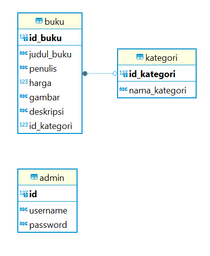

# Inventory Book

Inventory Book : Penyimpanan data buku

> Di sini, Adalah tempat untuk menyimpan data buku-buku yang ingin di simpan di dalam sebuah website. website ini di khususkan untuk satu pengguna saja atau untuk diri sendiri karena website ini adalah Inventory Book yang biasanya inventory adalah tempat untuk menyimpan sesuatu dan inventory ini di khususkan untuk menyimpan buku-buku dalam bentuk data.

> Project ini dibuat saat masa pemelajaran.

## Fitur

 **Admin**:

- Kelola book

## Diagram ER

## Tech stack

- Frontend: React, Tailwindcss
- Backend: Node JS
- Basis data: PostgreSQL
